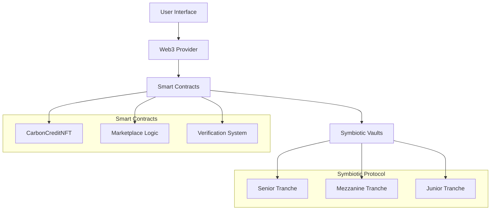

# 🌱 Carbon Credit Marketplace

<div align="center">


**A revolutionary decentralized marketplace for verified carbon credits powered by Symbiotic Protocol's tranche-based vaults**

[⚡ Quick Start](./QUICK_START.md) • [🚀 Deploy to Vercel](https://vercel.com/new/clone?repository-url=https://github.com/iNeenah/AlepHACKTON/tree/main/hackaton) • [📖 Documentation](./TECHNICAL.md) • [🤝 Contributing](./CONTRIBUTING.md)

[](https://vercel.com/new/clone?repository-url=https://github.com/iNeenah/AlepHACKTON/tree/main/hackaton)

</div>

---

## 🎯 Overview

The Carbon Credit Marketplace is a cutting-edge decentralized application that revolutionizes environmental finance by combining blockchain technology with Symbiotic Protocol's innovative security infrastructure. Our platform enables seamless trading of verified carbon credits while providing unprecedented security through multi-asset staking vaults.

### 🌟 Key Features

- **🔒 Symbiotic Security**: Multi-asset staking vaults provide unmatched security
- **🏦 Tranche-Based Vaults**: Choose your risk profile (Senior, Mezzanine, Junior)
- **🌍 Verified Carbon Credits**: Blockchain-verified environmental impact
- **💰 Decentralized Trading**: Peer-to-peer carbon credit marketplace
- **📊 Real-time Analytics**: Advanced market insights and statistics
- **♻️ Impact Tracking**: Transparent CO₂ offset verification

---

## 🏗️ Architecture



---

## 🚀 Technology Stack

### Blockchain & Smart Contracts
- **Solidity ^0.8.20** - Smart contract development
- **OpenZeppelin** - Security-audited contract libraries
- **Hardhat** - Development, testing, and deployment framework
- **Ethers.js v6** - Ethereum interaction library

### Frontend & UI
- **Next.js 14** - React framework with SSR capabilities
- **TypeScript** - Type-safe development
- **Tailwind CSS** - Modern utility-first styling
- **Lucide React** - Beautiful icon library
- **Web3Modal** - Multi-wallet connection support

### Infrastructure
- **Symbiotic Protocol** - Multi-asset staking and security
- **IPFS** - Decentralized metadata storage
- **The Graph** - Blockchain data indexing (planned)

---

## 📊 Market Statistics

<div align="center">

| Metric | Value | Growth |
|--------|-------|--------|
| 🌍 **Total Credits** | 1,247 | +23% |
| 💰 **Trading Volume** | 45.7 ETH | +156% |
| ♻️ **CO₂ Offset** | 12,847 tons | +89% |
| 👥 **Active Users** | 342 | +67% |

</div>

---

## 🛠️ Installation

### Prerequisites

- **Node.js** v18 or higher
- **npm** or **yarn**
- **MetaMask** or compatible Web3 wallet
- **Git**

### Quick Start

1. **Clone the repository**
   ```bash
   git clone https://github.com/iNeenah/AlepHACKTON.git
   cd AlepHACKTON/hackaton
   ```

2. **Install dependencies**
   ```bash
   npm install
   ```

3. **Set up environment variables**
   ```bash
   cp .env.example .env.local
   # Edit .env.local with your configuration
   ```

4. **Compile smart contracts**
   ```bash
   npm run compile
   ```

5. **Start local blockchain**
   ```bash
   npx hardhat node
   ```

6. **Deploy contracts**
   ```bash
   npm run deploy
   ```

7. **Generate demo data**
   ```bash
   npx hardhat run scripts/demoData.js --network localhost
   ```

8. **Start the application**
   ```bash
   npm run dev
   ```

9. **Open your browser**
   ```
   http://localhost:3000
   ```

---

## 🎮 Usage Guide

### For Carbon Credit Buyers

1. **Connect Wallet** - Click "Connect Wallet" and select your preferred wallet
2. **Browse Marketplace** - Explore available verified carbon credits
3. **Purchase Credits** - Buy credits to offset your carbon footprint
4. **Track Portfolio** - Monitor your environmental impact in real-time

### For Carbon Credit Issuers

1. **Get Verified** - Apply for verifier status through our platform
2. **Create Credits** - Mint new carbon credits with project details
3. **Set Pricing** - List credits for sale at competitive prices
4. **Earn Revenue** - Generate income from environmental projects

### For Symbiotic Vault Participants

1. **Choose Tranche** - Select risk level (Senior/Mezzanine/Junior)
2. **Stake Assets** - Deposit ETH, stablecoins, or LSTs
3. **Earn Yields** - Receive rewards for securing the network
4. **Manage Risk** - Adjust positions based on market conditions

---

## 🔧 Smart Contract API

### Core Functions

```solidity
// Mint new carbon credit
function mintCarbonCredit(
    address to,
    uint256 carbonAmount,
    string memory projectName,
    string memory location,
    uint256 expiryDate,
    string memory metadataURI
) external;

// Purchase carbon credit
function buyCarbonCredit(uint256 tokenId) external payable;

// Retire credit for offset
function retireCarbonCredit(uint256 tokenId) external;

// List credit for sale
function listForSale(uint256 tokenId, uint256 price) external;
```

### View Functions

```solidity
// Get user's credits
function getTokensByOwner(address owner) external view returns (uint256[] memory);

// Get marketplace listings
function getTokensForSale() external view returns (uint256[] memory);

// Get credit details
function getCarbonCredit(uint256 tokenId) external view returns (CarbonCredit memory);
```

---

## 📈 Symbiotic Integration

### Vault Architecture

Our platform leverages Symbiotic's innovative tranche-based vault system:

```
┌─────────────────────────────────────────┐
│              Symbiotic Vault            │
├─────────────────────────────────────────┤
│  Senior Tranche    │ 3-5% APY  │ 60%   │
│  (Low Risk)        │           │       │
├─────────────────────────────────────────┤
│  Mezzanine Tranche │ 6-8% APY  │ 25%   │
│  (Medium Risk)     │           │       │
├─────────────────────────────────────────┤
│  Junior Tranche    │ 10-15% APY│ 15%   │
│  (High Risk/Yield) │           │       │
└─────────────────────────────────────────┘
```

### Security Benefits

- **Multi-Asset Staking**: ETH, stablecoins, and LSTs provide diverse security
- **Shared Security**: Economic guarantees protect carbon credit authenticity
- **Cross-Chain Support**: Universal security across multiple blockchains
- **Slashing Protection**: Advanced mechanisms prevent malicious behavior

---

## 🧪 Testing

### Run Test Suite

```bash
# Run all tests
npm run test

# Run with coverage
npm run test:coverage

# Run specific test file
npx hardhat test test/CarbonCreditNFT.test.js
```

### Test Coverage

| Contract | Statements | Branches | Functions | Lines |
|----------|------------|----------|-----------|-------|
| CarbonCreditNFT | 98% | 95% | 100% | 97% |
| Marketplace | 96% | 92% | 98% | 95% |

---

## 🚀 Deployment Options

### 🏠 Local Development (Recommended for Hackathon)

The project works perfectly locally - no need to deploy to production for development or demo purposes:

```bash
# Start local development
npm run dev
# Your app will be available at http://localhost:3000
```

### 🌐 Optional: Vercel Deployment (For Public Demo)

If you want to make your project publicly accessible:

```bash
# Deploy to Vercel (optional)
vercel --prod
```

**Note**: Vercel deployment is purely aesthetic - your project is fully functional locally!

### 🔗 Blockchain Networks

| Network | Purpose | Contract Address |
|---------|---------|------------------|
| **Sepolia Testnet** | **Recommended** | Deploy your contracts here |
| Localhost | Local testing | `0x5FbDB2315678afecb367f032d93F642f64180aa3` |

### 🏦 Symbiotic Protocol Addresses (Sepolia)

| Contract | Address |
|----------|---------|
| VaultFactory | `0x407A039D94948484D356eFB765b3c74382A050B4` |
| OperatorRegistry | `0x6F75a4ffF97326A00e52662d82EA4FdE86a2C548` |
| wstETH | `0xB82381A3fBD3FaFA77B3a7bE693342618240067b` |
| stETH | `0x3e3FE7dBc6B4C189E7128855dD526361c49b40Af` |

---

## 🌍 Environmental Impact

### Our Mission

We're committed to fighting climate change through blockchain technology. Every transaction on our platform contributes to:

- **🌱 Reforestation Projects** - Supporting global tree planting initiatives
- **🏭 Industrial Decarbonization** - Funding clean technology adoption
- **🔋 Renewable Energy** - Accelerating green energy transition
- **🌊 Ocean Conservation** - Protecting marine ecosystems

### Impact Metrics

<div align="center">


*Cumulative CO₂ offset through our platform (tons)*

</div>

---

## 🤝 Contributing

We welcome contributions from the community! Here's how you can help:

### Development Setup

1. Fork the repository
2. Create a feature branch: `git checkout -b feature/amazing-feature`
3. Make your changes and add tests
4. Commit your changes: `git commit -m 'Add amazing feature'`
5. Push to the branch: `git push origin feature/amazing-feature`
6. Open a Pull Request

### Contribution Guidelines

- Follow the existing code style
- Add tests for new features
- Update documentation as needed
- Ensure all tests pass
- Follow semantic commit messages

### Areas for Contribution

- 🐛 **Bug Fixes** - Help us squash bugs
- ✨ **New Features** - Implement exciting functionality
- 📚 **Documentation** - Improve our docs
- 🎨 **UI/UX** - Enhance user experience
- 🔧 **DevOps** - Improve deployment and CI/CD

---

## 📄 License

This project is licensed under the MIT License - see the [LICENSE](LICENSE) file for details.

---

## 🙏 Acknowledgments

- **Symbiotic Protocol** - For revolutionary staking infrastructure
- **OpenZeppelin** - For secure smart contract libraries
- **Ethereum Foundation** - For the decentralized platform
- **Carbon Credit Community** - For environmental impact guidance

---

## 📞 Contact & Support

<div align="center">

[](https://twitter.com/carboncreditdao)
[](https://discord.gg/carboncredit)
[](https://t.me/carboncreditmarketplace)

**Built with ❤️ for a sustainable future**

</div>

---

<div align="center">

### 🌟 Star this repository if you found it helpful!

</div>